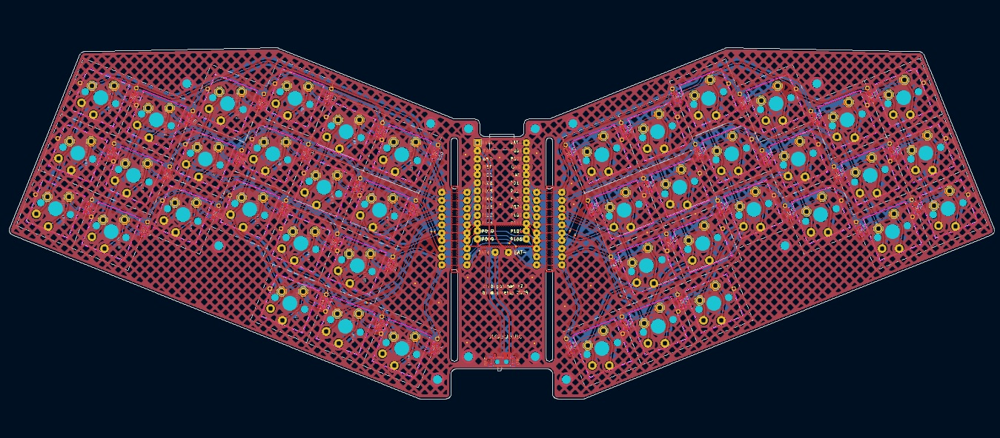

# crabapplepad v2

Wireless minimalistic foldable split keyboard



## Features

- Supports Kailh Choc and MX switches
- Optionally foldable with Choc switches
- Minimalistic. No LEDs, no RGB, no extra keys
- With Kailh Choc it's 3cm thick in the folded state
- Split. The two halves are connected with a 3d printed hinge
- Wireless. Uses Nice!Nano or ProMicro nRF52840 with BLE
- 42 keys (I use Cyrillic layout too and 36 keys is not enough)
- Apple Magic Trackpad can be magnetically attached (optional)

## PCB design

PCB is generated using [ergogen](https://github.com/ergogen/ergogen). Then it finished in KiCAD.
To regenerate the PCB run:

```bash
npx ergogen . --clean && open output/pcbs/kbd.kicad_pcb
```

NB! The final PCB was heavily modified in KiCAD

## Firmware

The firmware is based on [ZMK](https://zmkfirmware.dev/) and [Myrioku Layout](https://github.com/manna-harbour/miryoku) adapted for 42 keys. T

## Where is the slim V1?

It's in the [v1](https://github.com/kumekay/crabapplepad/tree/v1) branch. The V1 is ccm thick in the folded state with Kailh X switches. The V2 is 3cm thick with Kailh Choc switches.
