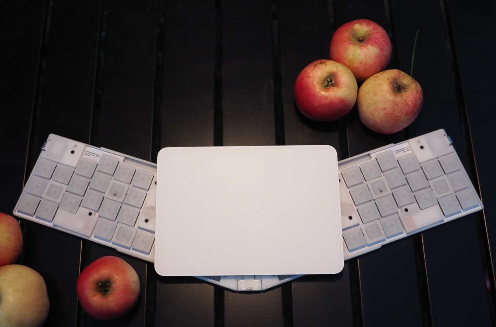
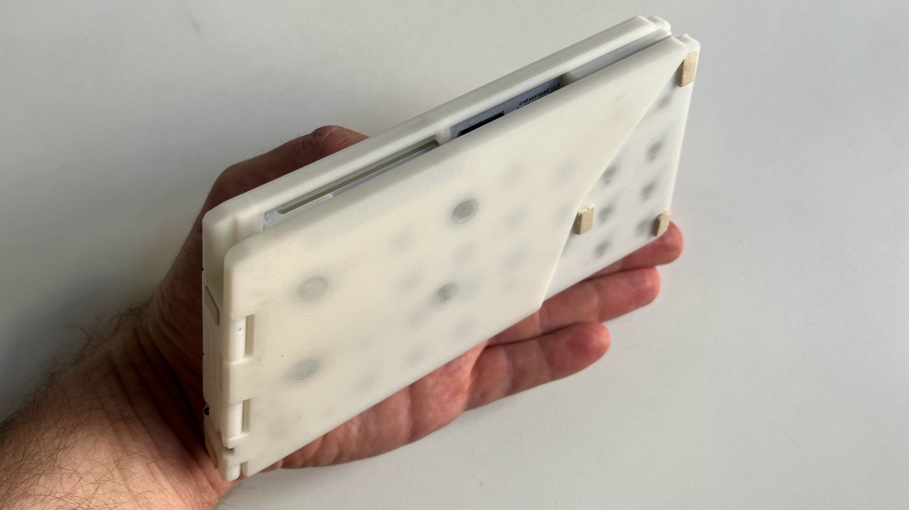
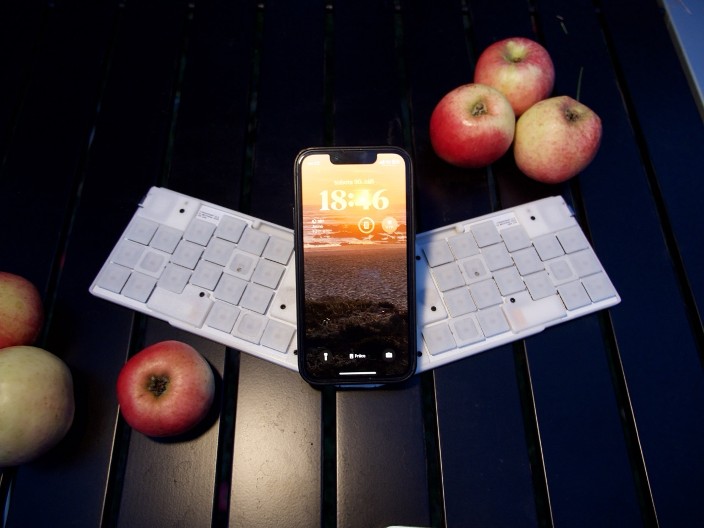

# crabapplepad

Wireless minimalistic slim foldable split keyboard



## Features

- Foldable. The keyboard can be folded and put in a pocket
- Minimalistic. No LEDs, no RGB, no extra keys
- With Kailh  Choc it's 3cm thick in the folded state
- Split. The two halves are connected with a 3d printed hinge
- Wireless. Uses Nice!Nano or ProMicro nRF52840 with BLE
- 42 keys (I use Cyrillic layout too and 36 keys is not enough)
- Apple Magic Trackpad can be magnetically attached




## PCB design

PCB is generated using [ergogen](https://github.com/ergogen/ergogen). Then it finished in KiCAD. The files are in the `hw` folder.

To regenerate the PCB run:

```bash
npx ergogen hw --clean && open output/pcbs/kbd.kicad_pcb
```

## Firmware

The firmware is based on [ZMK](https://zmkfirmware.dev/) and [Myrioku Layout](https://github.com/manna-harbour/miryoku) adapted for 42 keys. The firmware is in separate repos:

- [ZMK Shield for the keyboard](https://github.com/kumekay/crabapplepad_shield)
- [Myrioku Fork with the configs](https://github.com/kumekay/miryoku_zmk)

```

```
